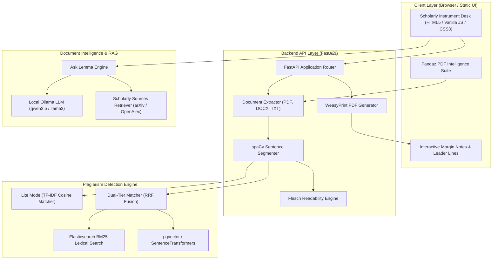

# Lemma 2.0 🎓

> **Local-First Academic Plagiarism Detection, Document Intelligence & Pandaz PDF Toolkit**

[](https://python.org)
[](https://fastapi.tiangolo.com)
[](https://netlify.com)
[](https://ollama.com)
[](LICENSE)
[](https://github.com/Devengoyal885/lemma-clone)

---

## 📌 Executive Summary

**Lemma 2.0** is an open-source, privacy-first **Scholarly Document Intelligence Platform** designed specifically for students, researchers, and academic institutions. 

Built with a manuscript-and-margin-notes layout (**Scholarly Instrument**), Lemma combines:
1. **Dual-Tier Plagiarism Engine**: Verbatim lexical overlap (TF-IDF + BM25) & semantic paraphrase analysis (Sentence-Transformers + pgvector).
2. **Character Coordinate Inspector**: spaCy token segmentation mapping exact sentence matches to absolute character offsets (`start_char`, `end_char`) with interactive margin callouts.
3. **Pandaz PDF Intelligence Suite**: Built-in 8+ PDF utility tools (Merge, Split, Compress, OCR, Tabular CSV Extraction, AI Summarizer, Digital Signature).
4. **Context-Aware Document RAG Assistant**: Local deterministic + LLM-backed interactive manuscript querying ("Ask Lemma").
5. **Local-First Execution (Lite Mode)**: Runs out-of-the-box with **zero infrastructure requirements** (no PostgreSQL or Docker required!).

---

## 🏛️ System Architecture



---

## ✨ Key Features & Capability Matrix

### 1. 🔍 Dual-Tier Plagiarism & Originality Detection
- **Lexical Overlap**: Detects exact copy-paste matching using TF-IDF and Elasticsearch BM25 ranking.
- **Semantic Paraphrase Detection**: Identifies structurally altered or synonym-replaced sentences using SentenceTransformer embeddings (`all-MiniLM-L6-v2`).
- **Reciprocal Rank Fusion (RRF)**: Merges rank scores from lexical and semantic passes to eliminate false positives.
- **Absolute Coordinate Mapping**: Every matched sentence retains precise character start/end coordinates for highlighting inside document viewers.

### 2. 📝 Scholarly Paraphraser Workbench
- **6 Paraphrasing Tones**: Academic, Professional, Simple, Concise, Detailed, Creative.
- **Batch Paraphrase**: 1-Click "Rewrite All Flagged Sentences" with real-time UI progress updates.
- **Live Re-Analysis**: Instant verification of score reduction after accepting rewritten passages.

### 3. 🤖 Ask Lemma (Context-Aware Document RAG Assistant)
- **Factual & Deterministic Query Engine**: Answers questions about document stats, top similarity sources, and readability without hallucinations.
- **Local LLM Integration**: Connects seamlessly to Ollama for interactive deep Q&A on manuscript contents.
- **Streaming Response Tokenization**: Natural conversational interface with zero data leaving your machine.

### 4. 📚 Academic Web Sources Discovery
- Fetches candidate papers from **arXiv**, **OpenAlex**, **Crossref**, and **Wikipedia**.
- Timeout-resilient asynchronous retrieval with fallback handling.

### 5. 🐼 Pandaz PDF Intelligence Suite
| Tool | Description |
|---|---|
| **PDF Merger** | Join multiple academic PDFs into a single unified file. |
| **PDF Splitter** | Extract custom page ranges into individual documents. |
| **PDF Compressor** | Optimize binary stream size with real-time byte metrics. |
| **PDF to CSV** | Extract structured table data directly into spreadsheet format. |
| **PDF Summarizer** | Generate executive TL;DRs, key takeaways, and research topics. |
| **OCR Scanner** | Convert scanned image-based PDFs into searchable text. |
| **PDF Signer** | Apply canvas digital signatures and text annotations. |
| **1-Click Handoff** | Directly send any processed Pandaz PDF output into Lemma's plagiarism desk. |

---

## ⚡ Lite Mode vs. Advanced Mode

Lemma automatically detects your environment and runs seamlessly in either mode:

| Capability | Lite Mode (Default) | Advanced Mode |
|---|---|---|
| **Prerequisites** | Standard Python 3.10+ | Docker, PostgreSQL, Elasticsearch, Redis |
| **Setup Time** | < 30 Seconds | 5 Minutes |
| **Plagiarism Engine** | Scikit-Learn TF-IDF + Cosine | Dual-Tier (Elasticsearch BM25 + pgvector) |
| **Reference Corpus** | Built-in JSON (`mock_references.json`) | Scalable PostgreSQL Database |
| **Document Storage** | In-Memory / Local Disk | PostgreSQL Relational Store |
| **Async Tasks** | Synchronous Execution (`CELERY_ALWAYS_EAGER`) | Celery Task Workers + Redis Queue |
| **Best For** | Local Dev, Laptops, Offline Usage, Netlify | High-Volume Production Deployments |

---

## 🚀 Quick Start Guide

### Prerequisites
- **Python 3.10+** ([Download Python](https://python.org))
- **Git** ([Download Git](https://git-scm.com))

### Step 1: Clone Repository
```bash
git clone https://github.com/Devengoyal885/lemma-clone.git
cd lemma-clone
```

### Step 2: Launch Application

#### **Windows** (Automatic Setup Script):
Double-click `run.bat` or run in PowerShell:
```powershell
.\run.bat
```

#### **macOS / Linux**:
```bash
chmod +x run.sh
./run.sh
```

#### **Manual Python Setup**:
```bash
# 1. Create & activate virtual environment
python -m venv venv
# On Windows:
call venv\Scripts\activate.bat
# On macOS/Linux:
source venv/bin/activate

# 2. Install dependencies
pip install -r requirements.txt
python -m spacy download en_core_web_sm

# 3. Launch server
$env:PYTHONPATH="backend"
python -m uvicorn app.main:app --port 8000 --reload
```

### Step 3: Access Workspace
Open your web browser and navigate to:
```
http://localhost:8000
```
- **Landing Page**: `http://localhost:8000/`
- **Dashboard Workspace**: `http://localhost:8000/dashboard.html`
- **Interactive OpenAPI Docs**: `http://localhost:8000/docs`

---

## 🦙 Ollama Local AI Setup (Optional)

To enable local AI text rewriting and document RAG features:

1. Download & Install [Ollama](https://ollama.com).
2. Pull your preferred LLM model:
   ```bash
   ollama pull qwen2.5:3b
   # or
   ollama pull llama3:8b
   ```
3. (Optional) Build the customized Lemma model prompt:
   ```bash
   ollama create lemma-model -f Modelfile
   ```
4. Verify status: Lemma's bottom health bar will automatically show **Ollama: Running**.

---

## 🛠️ Technology Stack

- **Frontend**: HTML5, Vanilla JavaScript (ES6+), CSS3 (CSS Variables, Flexbox/Grid), HTML5 Canvas.
- **Backend Framework**: FastAPI, Uvicorn, Pydantic v2.
- **NLP & Computational Analytics**: spaCy, scikit-learn, SentenceTransformers, NumPy.
- **Document Processing**: PyPDF, python-docx, WeasyPrint.
- **Optional Infrastructure**: PostgreSQL (pgvector), Elasticsearch 8, Redis, Celery.
- **Deployment**: Netlify (Frontend), Railway / Fly.io / Heroku (Backend).

---

## 📡 API Reference Overview

### Health Check Endpoint
```http
GET /health
```
```json
{
  "status": "ok",
  "project": "Lemma Plagiarism Analysis Platform",
  "services": {
    "database": { "status": "connected" },
    "elasticsearch": { "status": "healthy" },
    "ollama": { "status": "running", "model": "lemma-model" },
    "celery": { "status": "idle" }
  }
}
```

### Upload & Segment Document
```http
POST /api/v1/documents/upload
Content-Type: multipart/form-data
```
Returns extracted text, sentence coordinates, and Flesch readability metrics.

### Analyze Plagiarism (Async / Eager)
```http
POST /api/v1/analyze
Content-Type: multipart/form-data
```
Returns a `job_id` to poll status at `/api/v1/status/{job_id}`.

### Rewrite Text Segment
```http
POST /api/v1/rewrite
Content-Type: application/json
```
```json
{
  "text": "Existing text passage to rephrase...",
  "tone": "academic"
}
```

---

## 🧪 Running Unit & Integration Tests

Run the complete pytest test suite:

```bash
# Set PYTHONPATH to backend directory
set PYTHONPATH=backend     # Windows CMD
$env:PYTHONPATH="backend"  # Windows PowerShell
export PYTHONPATH=backend  # macOS/Linux

# Run tests
python -m pytest backend/tests -v
```

---

## 🤝 Contributing

Contributions are welcome! Please feel free to open issues or submit Pull Requests.

1. Fork the Project
2. Create your Feature Branch (`git checkout -b feature/AmazingFeature`)
3. Commit your Changes (`git commit -m 'Add some AmazingFeature'`)
4. Push to the Branch (`git push origin feature/AmazingFeature`)
5. Open a Pull Request

---

## 📜 License

Distributed under the **MIT License**. See `LICENSE` for details.

---

<div align="center">
  <b>Built with ❤️ by <a href="https://github.com/Devengoyal885">Deven Goyal</a></b>
</div>
